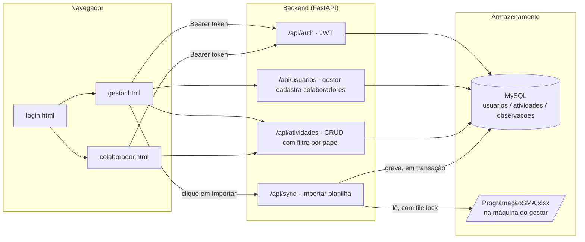

# Arquitetura — Dashboard Web SM&A (Login, Papéis, MySQL)

Este documento é a entrega de arquitetura pedida: análise do fluxo,
rotas REST, backend funcional de exemplo (implementado em `backend/`) e
sugestão de layout de frontend (implementado em `frontend-example/`).

Este é um sistema **novo**, adicional ao painel estático que já existe
neste repositório (`build_dashboard.py` → `docs/index.html` → GitHub
Pages). Aquele fluxo — sem login, sem escrita, um HTML autocontido — não
é tocado por nada aqui e continua funcionando exatamente como está.

---

## 1. Decisão de arquitetura: Excel *vs.* MySQL

O pedido original descreve duas coisas que, ao pé da letra, se
contradizem: "a planilha atua como banco de dados" **e** "banco de dados
através do MySQL". Não dá para as duas serem literalmente verdade ao
mesmo tempo — e a própria exigência de "bloqueio de concorrência para
evitar corrupção de dados" é o sintoma de que usar o `.xlsx` como
armazenamento editado por várias pessoas ao vivo é a fonte do problema,
não uma característica desejável. Arquivo Excel não tem transação, não
tem lock por linha, e dois gestores/colaboradores salvando ao mesmo
tempo corrompem ou se sobrescrevem.

**Decisão adotada:** MySQL é o banco de dados de verdade — todas as
leituras e escritas do dia a dia (status, prazos, observações,
cadastro de usuário) acontecem nele, e ele resolve concorrência sozinho
(transações + lock de linha do InnoDB). A planilha `ProgramaçãoSMA.xlsx`
deixa de ser editada ao vivo por várias pessoas e passa a ser **fonte de
importação**: o gestor aponta o caminho do arquivo e clica em "Importar
planilha" sempre que quiser trazer as linhas novas/atualizadas para o
MySQL (upsert por `N°` da planilha, protegido por um lock de arquivo
enquanto lê — ver seção 5). Isso preserva exatamente o hábito de trabalho
que vocês já têm (a planilha continua existindo e sendo a origem dos
dados), só move a "fonte de verdade operacional" para o banco depois que
os dados entram nele.

Se no futuro quiserem o caminho inverso — exportar o MySQL de volta para
`.xlsx` para quem prefere olhar em Excel — é um único endpoint a mais
(`GET /api/sync/exportar-excel`, não implementado nesta entrega, ver
seção 8).

---

## 2. Fluxo Frontend → Backend → MySQL (+ Excel)



**Passo a passo de uma requisição típica:**

1. Usuário faz login (`POST /api/auth/login`) → backend confere a senha
   (hash bcrypt) contra o MySQL e devolve um JWT contendo `sub` (id do
   usuário) e `role`.
2. O frontend guarda o token (`sessionStorage`) e o envia em
   `Authorization: Bearer <token>` em toda chamada seguinte.
3. Cada rota da API decodifica o token, carrega o usuário do MySQL e
   decide o que aquele papel pode ver/fazer — **sempre no servidor**,
   nunca confiando em um filtro só do frontend (ver `atividades.py`,
   função `listar_atividades`: o `WHERE colaborador_id = <eu>` é aplicado
   ali, não é o frontend que "esconde" linhas).
4. Escritas (`POST`/`PATCH`/`DELETE`) vão direto para o MySQL dentro de
   uma transação do SQLAlchemy — se algo falha no meio, `rollback()` e
   nada fica salvo pela metade.
5. A planilha só entra em cena quando o gestor pede uma importação: o
   backend abre o `.xlsx` sob um `FileLock`, lê as linhas e faz upsert no
   MySQL dentro de uma transação; se o lock não for obtido em 10s
   (arquivo aberto/travado), a importação falha de forma controlada em
   vez de ler dados inconsistentes.

---

## 3. Modelo de dados (MySQL)

| Tabela | Campos principais | Observação |
|---|---|---|
| `usuarios` | `id`, `nome`, `email` (único), `senha_hash`, `role` (`GESTOR`/`COLABORADOR`), `ativo` | senha nunca é armazenada em texto puro (bcrypt via `passlib`) |
| `atividades` | `id`, `numero_planilha` (único, nulo se criada só pela web), `descricao`, `local`, `data_inicio_prevista`, `data_fim_prevista`, `previsao_horas`, `situacao_prazo`, `status`, `colaborador_id` (FK), `criado_por_id` (FK) | `numero_planilha` é a chave usada para não duplicar ao reimportar |
| `observacoes` | `id`, `atividade_id` (FK), `usuario_id` (FK), `texto`, `criado_em` | histórico append-only — cada observação é uma linha nova, nunca sobrescreve a anterior |

Implementado em `backend/app/models.py` com SQLAlchemy; as tabelas são
criadas automaticamente (`Base.metadata.create_all`) na primeira subida
da API.

---

## 4. Rotas RESTful

| Método | Rota | Papel | Descrição |
|---|---|---|---|
| POST | `/api/auth/login` | público | autentica, devolve JWT + papel |
| GET | `/api/auth/me` | autenticado | dados do usuário logado |
| GET | `/api/usuarios` | GESTOR | lista todos os usuários |
| POST | `/api/usuarios` | GESTOR | cadastra colaborador ou gestor |
| PATCH | `/api/usuarios/{id}/desativar` | GESTOR | revoga acesso |
| GET | `/api/atividades` | ambos | GESTOR vê todas; COLABORADOR só as suas (filtrado no servidor) |
| POST | `/api/atividades` | GESTOR | cria atividade, opcionalmente já atribuída |
| PATCH | `/api/atividades/{id}` | ambos | GESTOR edita qualquer campo (prazo, local, atribuição...); COLABORADOR só o próprio `status`, e só se a atividade for dele |
| DELETE | `/api/atividades/{id}` | GESTOR | remove atividade |
| GET/POST | `/api/atividades/{id}/observacoes` | ambos (dono, no caso do colaborador) | histórico de observações diárias |
| POST | `/api/sync/importar-excel` | GESTOR | dispara a importação da planilha para o MySQL |

Por que não existe uma rota pública de "cadastro" (self-signup)?
Porque o próprio pedido define que **só o gestor cadastra
colaboradores** (seção 4-A do pedido original) — abrir cadastro público
permitiria qualquer pessoa criar a própria conta e acessar o sistema.
A "tela de Cadastro" existe, mas como uma tela do **gestor logado**
(`gestor.html`, formulário "Cadastrar colaborador"), não como uma tela
pública antes do login. O primeiro gestor do sistema é criado uma única
vez por script de linha de comando (`backend/create_admin.py`), rodado
por quem instala o sistema — não pela web.

---

## 5. Backend funcional (implementado em `backend/`)

Stack: **Python + FastAPI** (mesma linguagem que o `build_dashboard.py`
já usa neste repo, então não é preciso instalar um runtime novo) +
SQLAlchemy + MySQL (`pymysql`) + JWT (`python-jose`) + bcrypt
(`passlib`) + `openpyxl` para ler a planilha + `filelock` para o lock de
arquivo.

Trecho central — abrir a planilha, ler com lock, autenticar via JWT:

```python
# backend/app/services/excel_import.py (trecho)
def importar_planilha(db: Session, caminho: str | None = None) -> dict:
    caminho = caminho or settings.excel_import_path
    lock = FileLock(caminho + ".lock", timeout=10)

    with lock:                                   # trava enquanto lê
        wb = openpyxl.load_workbook(caminho, data_only=True)
        ws = wb["Atividades(SM&A)"]
        for row in ws.iter_rows(min_row=2, values_only=True):
            ...
            atividade = db.query(Atividade).filter(
                Atividade.numero_planilha == numero
            ).first()                             # upsert por N°
            ...
        db.commit()                               # tudo ou nada

# backend/app/security.py (trecho)
def get_current_user(token: str = Depends(oauth2_scheme), db=Depends(get_db)):
    payload = jwt.decode(token, settings.jwt_secret_key, algorithms=[settings.jwt_algorithm])
    usuario = db.get(Usuario, int(payload["sub"]))
    if usuario is None or not usuario.ativo:
        raise HTTPException(401, "Credenciais inválidas ou expiradas.")
    return usuario
```

Ver `backend/README.md` para instruções completas de como subir o MySQL
(via `docker compose`), instalar dependências e rodar a API localmente.

---

## 6. Frontend — estrutura visual

Seguindo o estilo já usado no painel atual (`template.html`: fundo claro,
barra lateral escura, acento laranja `#f7941e`), mas agora como páginas
dinâmicas que consomem a API em vez de dados embutidos no HTML.
Implementado em `frontend-example/` como HTML/CSS/JS puro (sem build
step), consistente com a filosofia "sem instalação" que o repo já tem —
mas nada impede migrar para React depois, se o projeto crescer (ver
seção 8).

**`login.html`** — formulário simples de e-mail/senha; guarda o JWT e
redireciona conforme o papel.

**`gestor.html`** — visão completa:
```
┌─────────────┬───────────────────────────────────────────┐
│ SM&A        │  Nova atividade                            │
│ [Nome]      │  [descrição] [local] [colaborador] [prazo] │
│             │  [Criar atividade]                         │
│ Importar    ├───────────────────────────────────────────┤
│ planilha    │  Todas as atividades                       │
│             │  Descrição | Local | Colaborador | Prazo | │
│ Sair        │  Status (badge verde/amarelo/vermelho)     │
│             ├───────────────────────────────────────────┤
│             │  Cadastrar colaborador                     │
│             │  [nome] [e-mail] [senha] [perfil] [Cadastrar]│
└─────────────┴───────────────────────────────────────────┘
```

**`colaborador.html`** — visão restrita, só as tarefas do próprio
usuário, com troca de status inline (`<select>`) e botão para anexar
observação do dia:
```
┌─────────────┬───────────────────────────────────────────┐
│ SM&A        │  Minhas atividades                         │
│ [Nome]      │  Descrição | Local | Prazo | Status ▾ | Obs│
│ Sair        │  (troca de status e observação por linha)  │
└─────────────┴───────────────────────────────────────────┘
```

O colaborador nunca vê a rotina de outros nem os controles de
criar/editar prazo/cadastrar gente — essas ações não existem na página
dele (defesa em profundidade: além da API bloquear no backend, a UI nem
oferece o botão).

---

## 7. Como rodar a entrega desta vez (dev/local)

```bash
cd backend
docker compose up -d                      # sobe o MySQL
cp .env.example .env                      # ajuste EXCEL_IMPORT_PATH
python -m venv .venv && source .venv/bin/activate
pip install -r requirements.txt
python create_admin.py "Seu Nome" voce@empresa.com "senha-forte"
uvicorn app.main:app --reload --port 8000

# em outro terminal, sirva o frontend-example/ como arquivo estático,
# por exemplo:
cd ../frontend-example
python -m http.server 5500
# abra http://localhost:5500/login.html
```

---

## 8. Fora do escopo desta entrega (próximos passos)

- **Hospedagem em produção** — GitHub Pages só serve arquivo estático,
  não roda Python nem MySQL; será preciso um serviço à parte (Render,
  Railway, um VPS, Azure/AWS). Fica para quando vocês decidirem onde
  hospedar — é uma decisão de custo/infra, não técnica.
- Exportação MySQL → `.xlsx` (caminho inverso da importação).
- Refresh token / logout com blacklist no servidor (hoje o JWT expira
  sozinho em 8h, configurável em `JWT_EXPIRE_MINUTES`).
- Testes automatizados.
- Migrar o frontend de HTML puro para React/Vue, se a interface crescer
  a ponto de compensar o build step.
